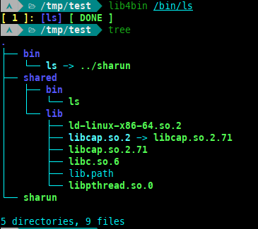

# sharun
Run dynamically linked ELF binaries everywhere (musl and glibc are supported).
* This works with [userland-execve](https://github.com/io12/userland-execve-rust) by mapping the interpreter (such as ld-linux-x86-64.so.2) into memory, creating a stack for it (containing the auxiliary vector, arguments, and environment variables), and then jumping to the entry point with the new stack.
* [lib4bin](https://github.com/VHSgunzo/sharun/blob/main/lib4bin) pulls out the binary file and all the libraries on which it depends, strip it (you can disable it with `STRIP=0` env var, see [lib4bin](https://github.com/VHSgunzo/sharun/blob/main/lib4bin#L15)) and forms the `bin`, `shared/{bin,lib,lib32}` directories (see [screenshots](https://github.com/VHSgunzo/sharun?tab=readme-ov-file#screenshots)) and generate a file `shared/{lib,lib32}/lib.path` with a list of all directories that contain libraries for pass it to interpreter `--library-path`. The paths in this file are specified on a new line with a `+` at the beginning and relative to the directory in which it is located.

## Supported architectures:
* aarch64
* x86_64

## To get started:
* **Download the latest revision**
```
git clone https://github.com/VHSgunzo/sharun.git && cd sharun
```

* **Compile a binary**
```
rustup default nightly
rustup target add x86_64-unknown-linux-musl
rustup component add rust-src --toolchain nightly
cargo build --release
```
* Or take an already precompiled binary file from the [releases](https://github.com/VHSgunzo/sharun/releases)

## Usage:
```
[ Usage ]: sharun [OPTIONS] [EXEC ARGS]...
|  Use lib4bin for create 'bin' and 'shared' dirs
|
[ Arguments ]:
|  [EXEC ARGS]...          Command line arguments for execution
|
[ Options ]:
|  -g,  --gen-lib-path     Generate library path file
|  -v,  --version          Print version
|  -h,  --help             Print help
|
[ Environments ]:
|  SHARUN_LDNAME=ld.so     Specifies the name of the interpreter
```

## Examples:
```
# create a directory and cd
mkdir test && cd test

# and copy 'sharun' to this directory
cp ../target/x86_64-unknown-linux-musl/release/sharun .

# run lib4bin with the paths to the binary files that you want to make portable
../lib4bin /bin/{curl,bash,ls}

# or for correct /proc/self/exe you can use HARD_LINKS=1
HARD_LINKS=1 ../lib4bin /bin/{curl,bash,ls}
# this ^ will create hard links to 'sharun' in the 'bin' directory

# now you can move 'test' dir to other linux system and run binaries from the 'bin' dir
./bin/ls -lha

# or specify them as an argument to 'sharun'
./sharun ls -lha
```

# Screenshots:


## References
* [userland-execve](https://crates.io/crates/userland-execve)
* https://brioche.dev/blog/portable-dynamically-linked-packages-on-linux